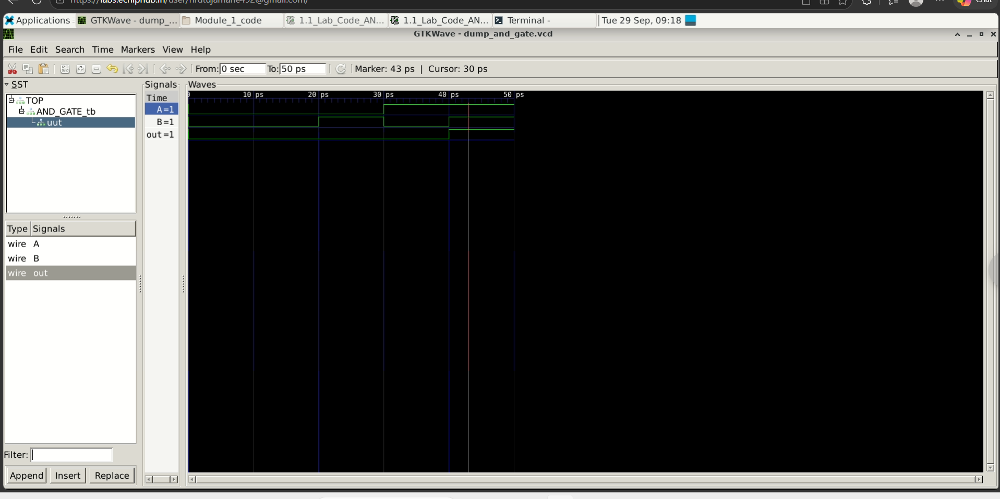

# Day 01 - 2-Input AND Gate using Verilog HDL

## Objective

Design and simulate a 2-input AND gate using Verilog HDL, run the simulation with Verilator, and verify the output waveform using GTKWave.

## Truth Table

| A | B | out |
|---|---|-----|
| 0 | 0 | 0 |
| 0 | 1 | 0 |
| 1 | 0 | 0 |
| 1 | 1 | 1 |

## RTL Logic

```verilog
assign out = A & B;
```

## Files

- `AND_GATE_design.v` - RTL design of the AND gate
- `AND_GATE_tb.v` - Testbench
- `waveform.png` - GTKWave simulation result
- `dump_and_gate.vcd` - Generated after running the simulation

## Tools Used

- Verilog HDL
- Verilator
- GTKWave
- Linux Terminal

## Compile

```bash
verilator --binary -Wall AND_GATE_design.v AND_GATE_tb.v --top-module AND_GATE_tb --timing --trace
```

## Run Simulation

```bash
./obj_dir/VAND_GATE_tb
```

## Open Waveform

After running the simulation, the testbench creates:

```text
dump_and_gate.vcd
```

Open it with:

```bash
gtkwave dump_and_gate.vcd
```

## Simulation Result

The simulation verifies the expected AND gate behavior:

| A | B | out |
|---|---|-----|
| 0 | 0 | 0 |
| 0 | 1 | 0 |
| 1 | 0 | 0 |
| 1 | 1 | 1 |

The output goes HIGH only when both inputs are HIGH.

## GTKWave Output



## What I Learned

- Basic Verilog module structure
- Implementing combinational logic in Verilog
- Writing a simple Verilog testbench
- Using `$monitor`, `$dumpfile`, and `$dumpvars`
- Compiling and simulating with Verilator
- Viewing and verifying digital waveforms using GTKWave
