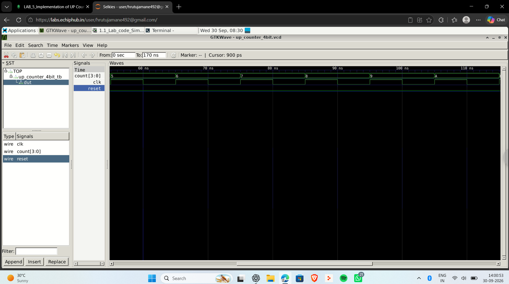
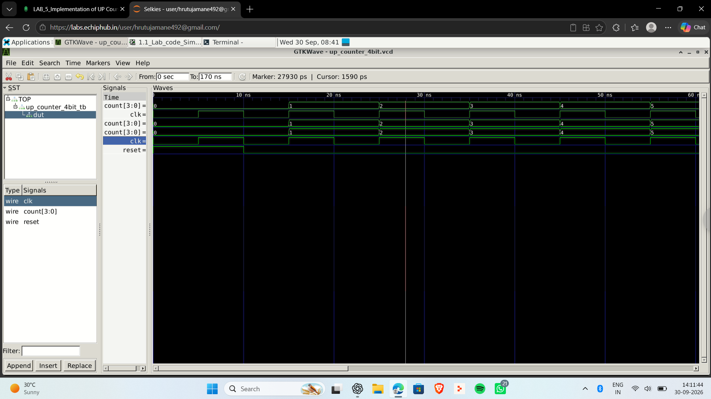

# Day 02 - 4-bit Up Counter using Verilog

## Objective
Design and simulate a 4-bit synchronous up counter.

## Signals
- `clk` : clock input
- `reset` : reset input
- `count[3:0]` : 4-bit counter output

## Operation
- When `reset = 1`, the counter is reset to `0000`.
- When `reset = 0`, the counter increments on every positive edge of `clk`.

## Files
- `up_counter_4bit.v`
- `up_counter_4bit_tb.v`
- `waveform_counter_1.png`
- `waveform_counter_2.png`
- `waveform_counter_3.png`

## Compile

```bash
verilator --binary -Wall up_counter_4bit.v up_counter_4bit_tb.v --top-module up_counter_4bit_tb --timing --trace
```

## Run

```bash
./obj_dir/Vup_counter_4bit_tb
```

## Open Waveform

```bash
gtkwave up_counter_4bit.vcd
```

## Waveforms






## Result
The counter increments correctly on successive positive clock edges and the waveform was verified in GTKWave.
