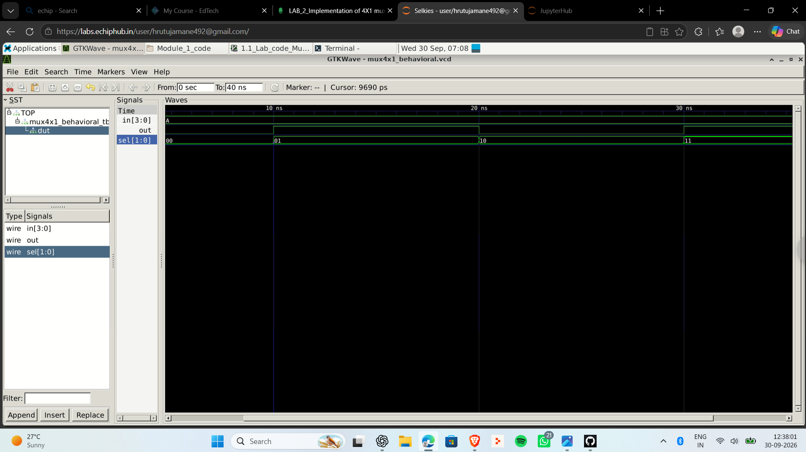
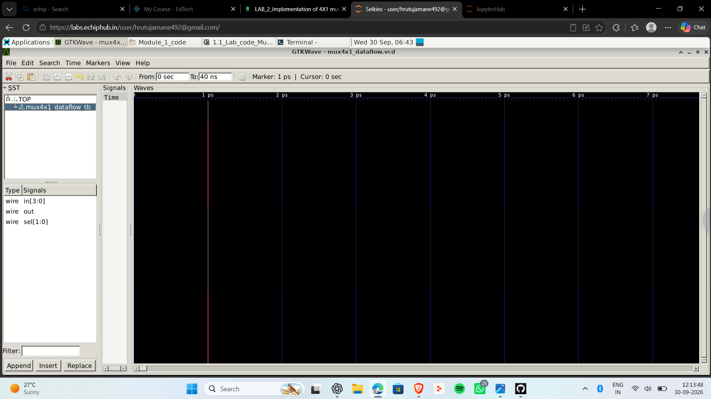
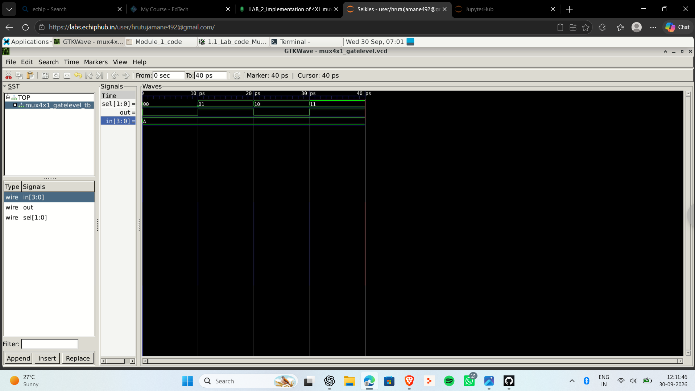

# Day 02 - 4x1 Multiplexer using Verilog

## Objective
Implement and simulate a 4x1 multiplexer using three modeling styles:

- Behavioral Modeling
- Dataflow Modeling
- Gate-Level Modeling

## Inputs and Output
- `in[3:0]` : four data inputs
- `sel[1:0]` : 2-bit select input
- `out` : selected output

## Selection Table

| sel | Output |
|---|---|
| 00 | in[0] |
| 01 | in[1] |
| 10 | in[2] |
| 11 | in[3] |

## Files
- `mux4x1_behavioral.v`
- `mux4x1_dataflow.v`
- `mux4x1_gatelevel.v`
- `mux4x1_tb.v`
- `waveform_behavioral.png`
- `waveform_dataflow.png`
- `waveform_gatelevel.png`

## Compile Example - Behavioral

```bash
verilator --binary -Wall mux4x1_behavioral.v mux4x1_tb.v --top-module mux4x1_tb --timing --trace
./obj_dir/Vmux4x1_tb
gtkwave mux4x1.vcd
```

For Dataflow or Gate-Level modeling, replace the instantiated module name inside `mux4x1_tb.v` with `mux4x1_dataflow` or `mux4x1_gatelevel`.

## Waveforms

### Behavioral


### Dataflow


### Gate-Level


## Result
The 4x1 MUX was implemented using multiple Verilog modeling styles and verified using GTKWave.
